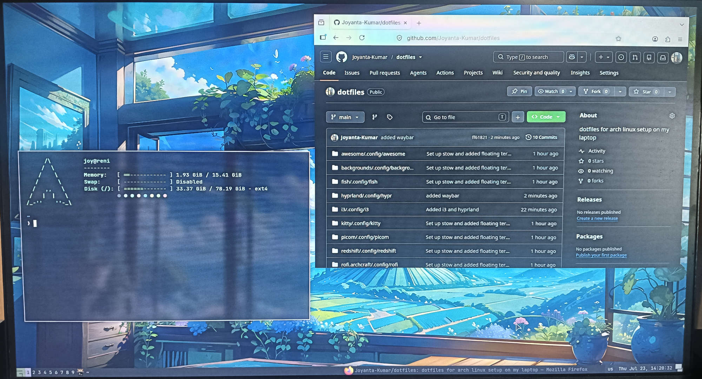

# Dotfiles for my linux setup

Borrowed idea and configs from  

## Colors
- Catppuccin
- Nord
- Dracula
- Everforest
- Gruvbox

# Others

- typecraft
- learn linux tv
- hyprland
- i3



I don't know how to take screenshot ;)


## Usage

1. clone the repo.
2. install gnu stow.

```sh
stow [package]
```
